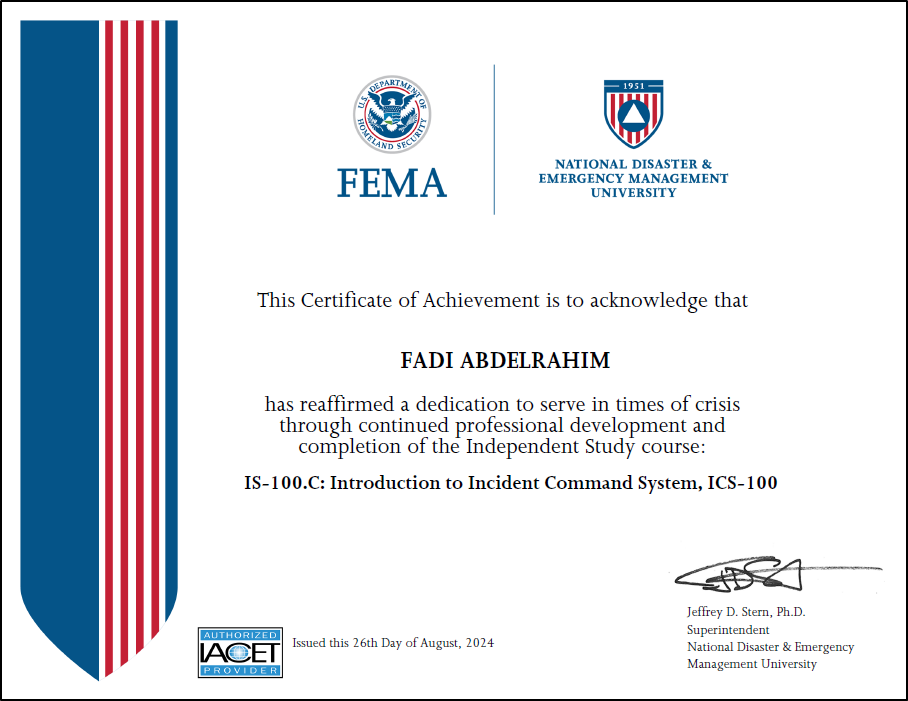

# 
 <a href="https://www.linkedin.com/in/fadi-a-92082a199/">Fadi Abdelrahim</a>
 
*Cybersecurity Professional*

 A dedicated cybersecurity professional with a Master’s degree in Cybersecurity and hands-on experience through academic projects and independent learning, including automating threat detection and incident response. Ranked in the top 3% on TryHackMe, demonstrating strong skills in network security, vulnerability management, and incident response. Proficient in industry-standard tools and technologies, with practical experience in penetration testing, IT risk management, and security analysis. Completed coursework aligned with leading industry certifications in cybersecurity fundamentals, vulnerability management, and security analysis. Passionate about cybersecurity, with a commitment to continuous learning and defending against emerging threats.
  
## 🔒 Cybersecurity Projects:

- **SOAR-EDR Project**
  - [SOAR-EDR Project](https://github.com/fadiabdelrahim/SOAR-EDR)
 
- **SOC + Honeynet In Azure Project**
  - [Building A SOC + Honeynet In Azure](https://github.com/fadiabdelrahim/Building-A-SOC-Honeynet-In-Azure)

- **Active Directory Project**
  - [Active Directory Home Lab](https://github.com/fadiabdelrahim/Active-Directory)
 
- **Critical Infrastructure Project**
  - [SCADA Control Systems Lab](https://github.com/fadiabdelrahim/SCADA-Control-Systems)

- <b>Proof of Concept Projects</b>
  - [Harvesting Credentials](https://github.com/fadiabdelrahim/Harvesting-Credentials)
  - [Payload Deployment](https://github.com/fadiabdelrahim/Payload-Deployment)
  - [Keylogger](https://github.com/fadiabdelrahim/Keylogger)
  - [MITM Attack](https://github.com/fadiabdelrahim/MITM-Attack)
  - [Mimikatz](https://github.com/fadiabdelrahim/Mimikatz)
 
## 👨‍💻 Software Development Projects:

- <b>Data Structures and Algorithms </b>
  - [Data Structures & Algorithms in Python](https://github.com/fadiabdelrahim/Data-Structures-and-Algorithms-in-Python)
- <b>PowerShell</b>
  - [Active Directory Bulk User Creation](https://github.com/fadiabdelrahim/Active-Directory-Bulk-User-Creation)
- <b>Blockchain</b>
  - [Basic Blockchain Project](https://github.com/fadiabdelrahim/Blockchain)  

  
### Languages and Tools

 

#

<h3>Degree & Certifications</h3>
 
  

  

  

  

  

  

<h2> 🤳 Connect with me:</h2>

[][linkedin]

[linkedin]: https://www.linkedin.com/in/fadiabdelrahim

